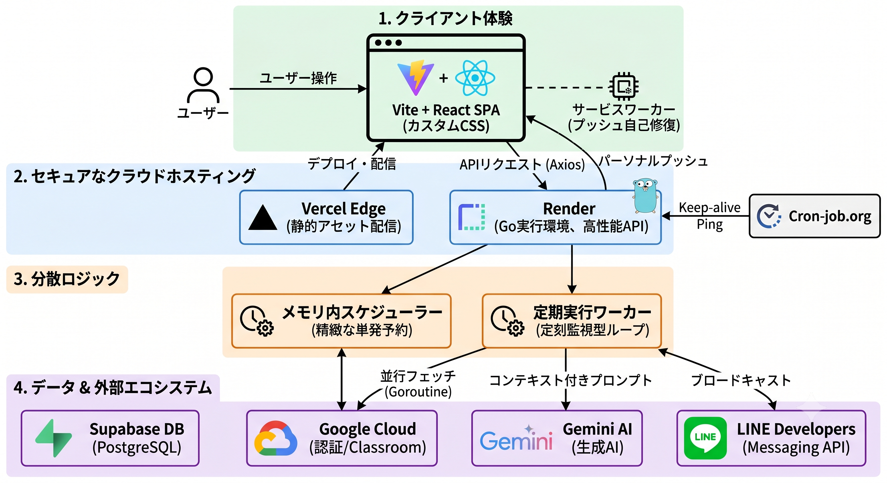

# Uni-Steps ｜ AIと仲間が，あなたの「一歩」を支える

AIによる課題解析・リマインドと，仲間との起床見守りを統合した，次世代のライフリズム支援プラットフォームです．
「コストゼロ」で「プロフェッショナル品質」のサービスを実現するための，クリーンアーキテクチャに基づいたフルスタック・アプリケーションです．

---

## 🌟 コア・コンセプト

**「一人じゃないから，一歩踏み出せる」**
Uni-Stepsは，単なるタスク管理ツールではありません．グループ内での予定共有にAIが介入し，最適なタイミングとメッセージでリマインドを行うことで，タスクの完遂と良好な生活リズムを「仲間と一緒に」作り出すことを目的としています．

## 🚀 主要機能

*   **🤖 AI スマート・リマインド**: Google Gemini APIを活用し，課題の内容や締切に応じた「心に刺さる」メッセージを自動生成．AIの性格（教官・幼馴染・執事など）を部屋ごとにカスタマイズ可能．
*   **🔄 LMS フル同期**: Google Classroom等と完全連携．Goroutineを用いた並列取得により，複数コースの課題を瞬時に同期します．
*   **⏰ クリティカル起床確認**: 絶対に外せない予定がある朝，チェックインがない場合にグループ全員へSOS通知を自動配信．仲間のサポートで寝坊を防ぎます．
*   **📱 ハイブリッド通知**: LINE（グループ共有）と Web Push（個人宛）を組み合わせた，死角のない通知システム．失効したトークンの「自己修復機能」も搭載．
*   **🌿 オーガニック・デザイン**: デジタル特有の圧迫感を排除した，温かみのある配色と使い心地．モバイル・ファーストな設計で，どこでも快適に操作できます．

---

## 🛠 テックスタック

| カテゴリ | 採用技術 |
| :--- | :--- |
| **Frontend** | **React 19 + TypeScript / Vite** |
| **Backend** | **Go 1.22 + Echo v4** |
| **Database** | **Supabase (PostgreSQL) / GORM** |
| **Intelligence**| **Google Gemini API (Flash/Lite)** |
| **Messaging** | **LINE Messaging API / Web Push** |
| **Infrastructure** | **Vercel / Render / Cron-job.org** |

---

## 🏗 アーキテクチャのこだわり

本プロジェクトは **Clean Architecture** を採用し，ビジネスロジックを外部技術（DBやAPI）から完全に独立させています．

1.  **Domain (魂)**: エンティティとインターフェースを定義し，システムの不変的なルールを記述．
2.  **Usecase (頭脳)**: データの同期や通知の予約など，具体的なシナリオの手順を制御．
3.  **Interfaces/Handler (窓口)**: HTTPリクエストを解釈し，ビジネスロジックへ橋渡し．
4.  **Infrastructure (具現化)**: データベース操作やAI APIとの通信など，具体的な技術を実装．

また，フロントエンドにおいても **Go言語スタイルのエラーハンドリング** を導入し，プロジェクト全体で一貫した開発哲学を貫いています．

---

## 📂 ディレクトリ構成

*   `domain/`: システムの核となるルールとデータ形状
*   `usecase/`: 業務フローとシナリオの記述
*   `interfaces/`: 外部からのリクエスト受付（Handler）
*   `infrastructure/`: 外部API・DBの具体的な実装
*   `frontend/`: Reactによるユーザーインターフェース
*   `docs/`: 技術仕様書，ER図，デプロイガイド等の集約

---

## 🏁 クイックスタート

詳細なセットアップ手順については，以下のドキュメントを参照してください．

*   **開発・デプロイガイド**: `docs/references/deployment.md`
*   **インフラ設定（Google/LINE）**: `docs/infrastructure/`

---
*Uni-Steps: Your life rhythm partner.*
