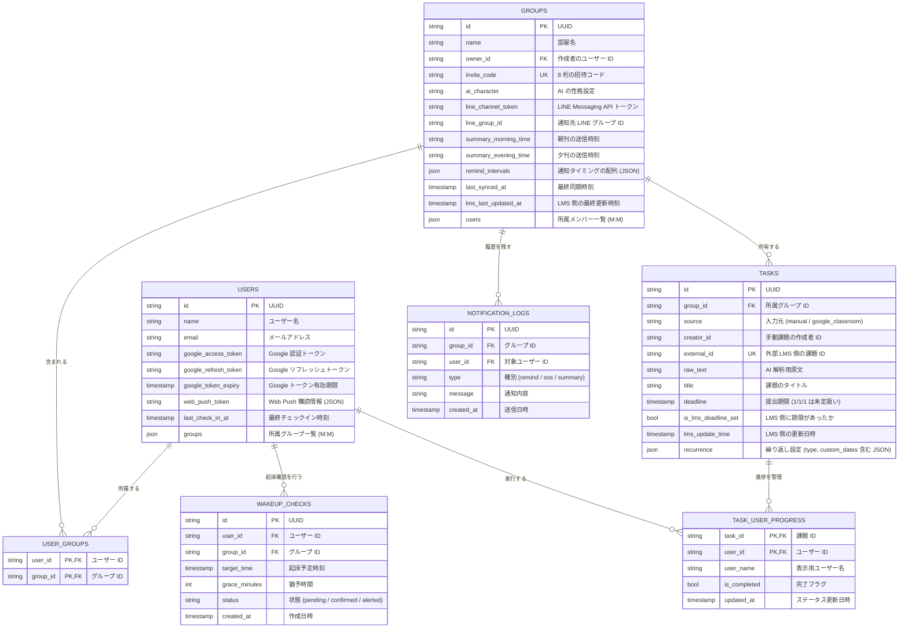

# Uni-Steps データベース設計書 (ER図)

本ドキュメントは，Uni-Steps システムにおけるデータベースの構造，テーブル間の関係性，および各カラムの詳細を定義したものである．

## 1. データベース概要
- **エンジン**: PostgreSQL (Supabase)
- **ORM**: GORM (Go Object Relational Mapping)
- **タイムゾーン**: 全てのタイムスタンプは日本時間 (Asia/Tokyo) を基準とする．

## 2. ER 図 (Entity Relationship Diagram)

## 3. テーブル定義詳細

### 3.1 TASKS (課題)
- `external_id`: 外部 LMS における課題の一意識別子である．`group_id` との複合ユニークインデックス (`idx_group_external`) が設定されており，異なる部屋であれば同じ外部課題を重複して保持することが可能である．
- `creator_id`: 手動で登録された課題において，誰が作成したかを管理する．権限チェック（編集・削除）に使用される．

---
*最終更新日: 2026年6月15日*
