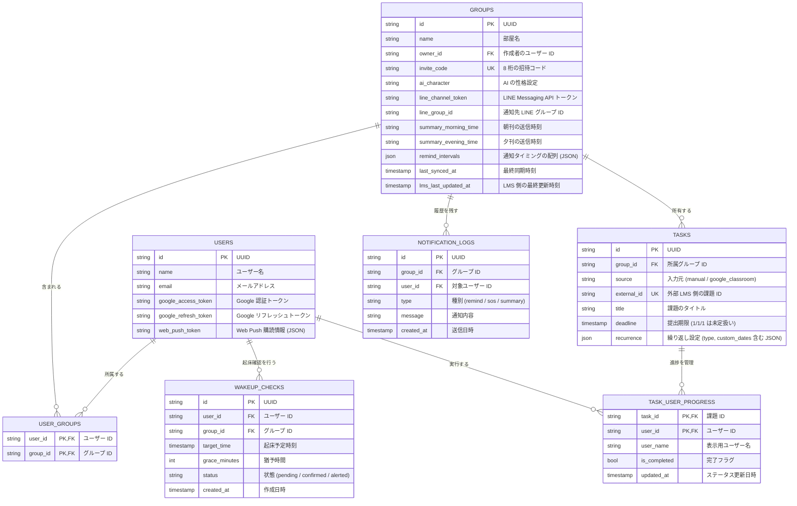

# Uni-Steps データベース設計書 (ER図)

本ドキュメントは，Uni-Steps システムにおけるデータベースの構造，テーブル間の関係性，および各カラムの詳細を定義したものである．

## 1. データベース概要
- **エンジン**: PostgreSQL (Supabase)
- **ORM**: GORM (Go Object Relational Mapping)
- **タイムゾーン**: 全てのタイムスタンプは日本時間 (Asia/Tokyo) を基準とする．

## 2. ER 図 (Entity Relationship Diagram)

## 3. テーブル定義詳細

### 3.1 USERS (ユーザー)
システムを利用する個人を管理する．
- `web_push_token`: ブラウザから取得した通知用エンドポイント情報を JSON 文字列として保持する．

### 3.2 GROUPS (部屋)
複数のユーザーが課題を共有する単位である．
- `ai_character`: AI が生成するメッセージのトーンを決定する．
- `summary_morning_time` / `summary_evening_time`: チーム全体へのサマリー送信タイミングを HH:mm 形式で保持する．
- `remind_intervals`: 期限の何分前にリマインドするかを最大 3 つまで保持する JSON 配列である．
- `invite_code`: ユニーク制約を持ち，他のユーザーが部屋に参加するためのキーとなる．
- `last_synced_at`: Google Classroom との自動同期におけるクールダウン制御やログとして使用する．

### 3.3 TASKS (課題)
LMS から同期された課題，または手動で作成された課題の基本情報を保持する．
- `external_id`: Google Classroom 側での ID．これを用いて同期時の重複登録を防止する．
- `deadline`: 未設定の場合は Go のゼロ値 (`0001-01-01`) が入り，UI 上は「未定」と表示される．
- `recurrence`: 繰り返しのタイプ（none/weekly 等）と，カスタム日付のリストを包含する JSON オブジェクトである．
### 3.4 WAKEUP_CHECKS (起床確認)
生活リズムの改善を支援する起床見守りのスケジュールと結果を保持する．
- `status`: `pending`（待ち），`confirmed`（成功），`alerted`（失敗/SOS発動）のいずれかである．

### 3.5 USER_GROUPS (ユーザー・グループ紐付け)
どのユーザーがどの部屋に所属しているかを管理する多対多の交差テーブルである．

### 3.6 NOTIFICATION_LOGS (通知履歴)
過去に送信された全ての通知メッセージを記録するテーブルである．
- これによりスマホの通知を消去した後でも，アプリ内のタイムラインから AI の発言や SOS の歴史を確認することが可能である．

---
*最終更新日: 2026年6月11日*
