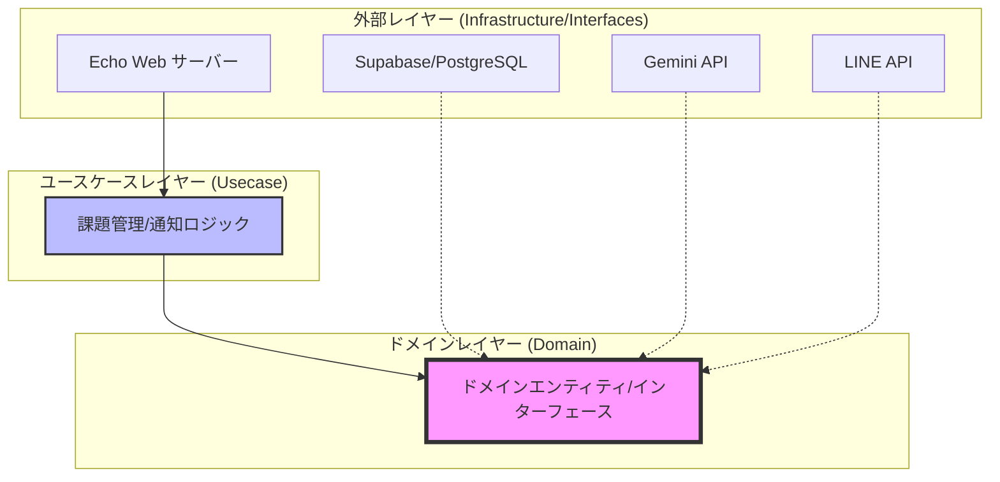
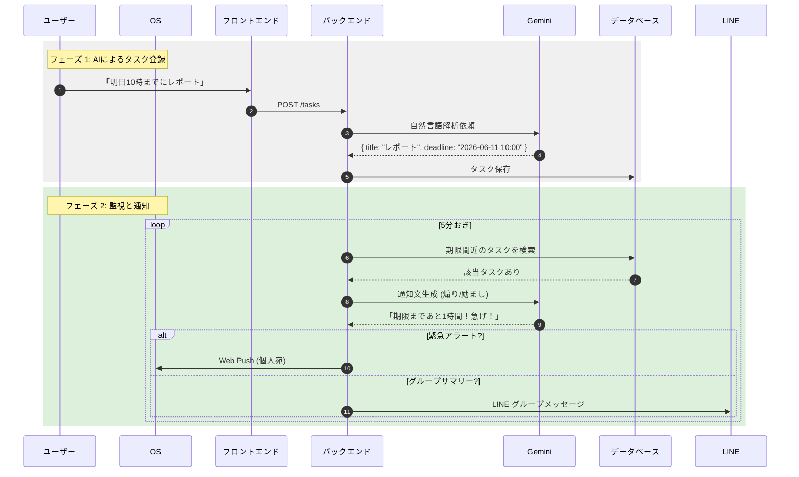

# アーキテクチャ設計 (DDD & Clean Architecture)

## 1. クリーンアーキテクチャの構造
Uni-Stepsは，外部要因（DBやAPIの変更）に左右されない堅牢な設計を採用している．

```mermaid
graph TD
    subgraph "外部レイヤー (Infrastructure/Interfaces)"
        HTTP[Echo Web サーバー]
        DB[Supabase/PostgreSQL]
        AI[Gemini API]
        LINE[LINE API]
    end

    subgraph "ユースケースレイヤー (Usecase)"
        UC[課題管理/通知ロジック]
    end

    subgraph "ドメインレイヤー (Domain)"
        DM[ドメインエンティティ/インターフェース]
    end

    HTTP --> UC
    UC --> DM
    DB -.-> DM
    AI -.-> DM
    LINE -.-> DM

    style DM fill:#f9f,stroke:#333,stroke-width:4px
    style UC fill:#bbf,stroke:#333,stroke-width:2px
```

## 2. 処理フロー (シーケンス図)
システム全体を貫く一貫した処理の流れである．

```mermaid
sequenceDiagram
    autonumber
    rect rgb(240, 240, 240)
    Note over ユーザー, OS: フェーズ 1: AIによるタスク登録
    ユーザー->>フロントエンド: 「明日10時までにレポート」
    フロントエンド->>バックエンド: POST /tasks
    バックエンド->>Gemini: 自然言語解析依頼
    Gemini-->>バックエンド: { title: "レポート", deadline: "2026-06-11 10:00" }
    バックエンド->>データベース: タスク保存
    end

    rect rgb(220, 240, 220)
    Note over ユーザー, OS: フェーズ 2: 監視と通知
    loop 5分おき
        バックエンド->>データベース: 期限間近のタスクを検索
        データベース-->>バックエンド: 該当タスクあり
        バックエンド->>Gemini: 通知文生成 (煽り/励まし)
        Gemini-->>バックエンド: 「期限まであと1時間！急げ！」
        alt 緊急アラート?
            バックエンド->>OS: Web Push (個人宛)
        else グループサマリー?
            バックエンド->>LINE: LINE グループメッセージ
        end
    end
    end
```
