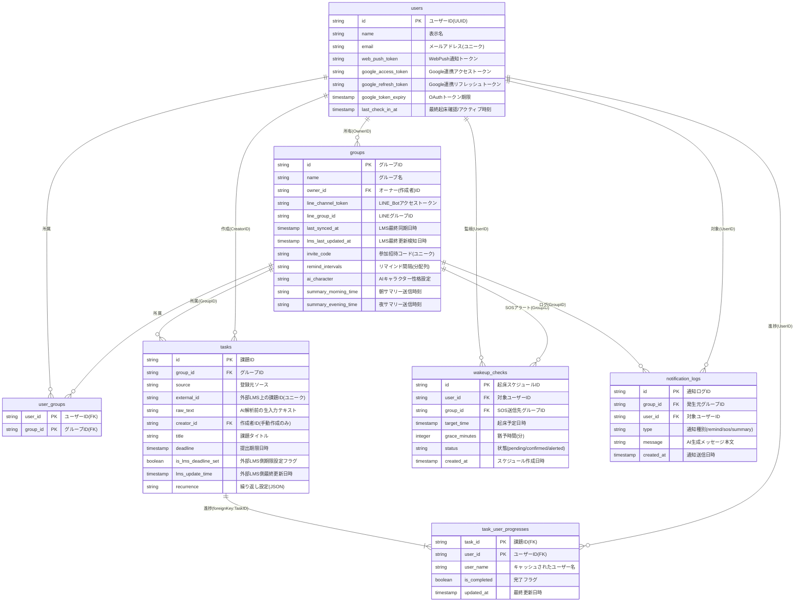

# Uni-Steps データベース仕様書

本ドキュメントでは，タスク・生活管理アプリ「Uni-Steps」のデータベース物理構造，各テーブルの役割，各フィールドの値の説明，および GORM を介したアソシエーション（関連性）について解説する．

---

## 1. データベース ER 図

以下に，システムを構成する各テーブルとリレーションシップを表す ER 図を示す．リレーションのラベルやキー定義，説明文はすべて日本語で記述している．



---

## 2. ER 図の記号（線と端点）の意味

ER 図のテーブル間を結ぶ線と端点の記号は，テーブル間の**関連性（カーディナリティ）**を表している．

```
  [ テーブル A ]  ────── 端点記号 ──────  [ テーブル B ]
```

### ① 端点記号の種類
線の両端にある記号は，関連するレコードの「数（最小値と最大値）」を表す．
*(※ Markdownのテーブル仕様上，縦棒記号 `|` は `\|` とエスケープして表記している)*

| 記号 | 意味 | 解説 |
| :---: | :--- | :--- |
| `\|\|` | **必ず1つ** (Exactly One) | 相手側のレコードが，必ず1つだけ存在する． |
| `\|o` | **0または1つ** (Zero or One) | 相手側のレコードが存在しない（0）か，あっても1つだけである． |
| `\|{` | **1つ以上** (One or Many) | 相手側のレコードが，最低1つ以上存在する（複数可）． |
| `o{` | **0個以上** (Zero or Many) | 相手側のレコードが存在しない（0）か，複数存在する（0以上）． |

### ② 本設計における具体的な線の読み方

*   **`users ||--o{ groups` (所有)**
    *   `users` 側（左）が `||`：1人のグループオーナー（User）に対し，
    *   `groups` 側（右）が `o{`：所有されるグループは0個以上存在する（複数可）．
*   **`tasks ||--|{ task_user_progresses` (進捗)**
    *   `tasks` 側（左）が `||`：1つの課題に対し，
    *   `task_user_progresses` 側（右）が `|{`：対応するメンバーの進捗データは必ず「1つ以上」存在する．
*   **`users ||--o{ user_groups` (中間テーブル)**
    *   `users` 側（左）が `||`：1人のユーザーに対し，
    *   `user_groups` 側（右）が `o{`：所属レコードは0個以上存在する（所属グループがない場合は0）．

---

## 3. キー属性（PK・FK・UK）の意味

データベースの設計やER図において，カラムの横に記載されている `PK`，`FK`，および説明文の `ユニーク` は，データの一意性や関連性を保証するための**制約（キー属性）**である．

### ① PK (Primary Key：主キー)
*   **意味**: テーブル内のレコード（データ）を一意（ユニーク）に識別するためのカラムである．重複する値や `NULL`（空の値）を登録することはできない．
*   **本アプリでの例**:
    *   `users.id`：各ユーザーを一意に特定するID．
    *   `tasks.id`：各課題を一意に特定するID．
*   **複合主キー (Composite PK)**:
    *   複数のカラムを組み合わせて1つの主キーとして扱う設計である．例えば，`task_user_progresses` テーブルでは，`task_id` と `user_id` の2つを合わせてPKとしている．これにより，**「同じタスクに対して，同じユーザーの進捗データが2つ以上登録されること」**を防いでいる．
    *   *ER図上での表記*: MermaidのER図上では，**同一のテーブル（エンティティ）内に `PK` というラベルがついたカラムが複数存在する場合，それらすべてのカラムの組み合わせが「複合主キー」であること**を示している（例: `user_groups` や `task_user_progresses` テーブル）．

### ② FK (Foreign Key：外部キー)
*   **意味**: 他のテーブルの主キー（PK）を参照し，テーブル同士を関連付ける（紐づける）ためのカラムである．存在しない不正なIDが登録されるのを防ぎ，データの整合性（参照整合性）を保つ役割を持つ．
*   **本アプリでの例**:
    *   `groups.owner_id`（FK）：`users.id` を参照している．これにより，「存在するユーザーしかグループのオーナーになれない」というルールが強制される．
    *   `tasks.group_id`（FK）：`groups.id` を参照している．どの課題も，必ず存在するいずれかのグループに所属しなければならないことを保証する．

### ③ UK / ユニーク制約 (Unique Key：一意キー)
*   **意味**: テーブル内でその値が重複することを禁止する制約である．PKと似ているが，PKがテーブルに1つしか設定できないのに対し，ユニーク制約は複数のカラムに設定でき，`NULL`（空の値）を許容する場合がある．
*   **本アプリでの例**:
    *   `users.email`：同じメールアドレスで複数のアカウントが作られるのを防ぐ．
    *   `groups.invite_code`：招待コードが他のグループと重複するのを防ぐ．
    *   `tasks` の `idx_group_external`：`group_id` と `external_id` の組み合わせに対して設定された複合ユニーク制約である．外部LMS（Google Classroom等）から課題を同期する際，**「同じグループ内に，同じLMS課題IDを持つタスクが重複して登録されること」**を防いでいる．

---

## 4. データ連携の具体例（具体的なデータの中身とつながり）

実際の利用シーン（ユースケース）を想定し，データベース内でレコードがどのように生成され，外部キー（ID）を通じて繋がっていくかを具体例で示す．

### シナリオ：Aliceがグループを作り，手動タスクを登録して，Bobがそれを完了する

#### STEP 1: ユーザーの登録とグループの作成
Alice（ID: `usr-alice`）がグループ「Web開発ゼミ」（ID: `grp-web`）を作成する．この時，グループの管理者（オーナー）は Alice になるため，`OwnerID` に `usr-alice` がセットされる．

*   **`users` テーブル**
    ```json
    { "id": "usr-alice", "name": "Alice", "email": "alice@example.com" }
    ```
*   **`groups` テーブル**
    ```json
    { "id": "grp-web", "name": "Web開発ゼミ", "owner_id": "usr-alice" }
    ```
    *(※ `groups.owner_id` が `users.id` を指し示し，「Aliceが所有する部屋」であることが表現される)*

---

#### STEP 2: 別のユーザー（Bob）の参加
Bob（ID: `usr-bob`）が招待コードを使ってグループ「Web開発ゼミ」に参加する．
多対多のリレーションを解決するため，中間テーブル `user_groups` にレコードが追加される．

*   **`users` テーブル（追加）**
    ```json
    { "id": "usr-bob", "name": "Bob", "email": "bob@example.com" }
    ```
*   **`user_groups` 中間テーブル**
    | user_id (FK) | group_id (FK) |
    | :--- | :--- |
    | `usr-alice` | `grp-web` |
    | `usr-bob` | `grp-web` |

    *(※ 中間テーブルのレコードによって，Alice と Bob の両名が「Web開発ゼミ」の所属メンバーとして紐づく)*

---

#### STEP 3: Aliceによる課題（タスク）の登録
Aliceが「Go言語入門レポート」という課題（ID: `tsk-go`）をこのグループに登録する．
作成者はお Alice（ID: `usr-alice`），登録先グループは Web開発ゼミ（ID: `grp-web`）となる．

*   **`tasks` テーブル**
    ```json
    {
      "id": "tsk-go",
      "group_id": "grp-web",
      "creator_id": "usr-alice",
      "title": "Go言語入門レポート",
      "deadline": "2026-06-30T23:59:59Z"
    }
    ```
    *(※ `tasks.group_id` は `groups.id` と繋がっており，`tasks.creator_id` は `users.id` と繋がっている)*

---

#### STEP 4: 進捗レコード（TaskUserProgress）の自動生成
課題（`tsk-go`）が登録されると，システムは所属メンバー全員（AliceとBob）分の進捗レコードを自動的に生成し，未完了状態で登録する．

*   **`task_user_progresses` テーブル**
    | task_id (FK) | user_id (FK) | user_name | is_completed |
    | :--- | :--- | :--- | :--- |
    | `tsk-go` | `usr-alice` | Alice | **false** |
    | `tsk-go` | `usr-bob` | Bob | **false** |

    *(※ `task_id` は親タスク `tsk-go` に，`user_id` はそれぞれのユーザーIDに繋がっており，誰がどの課題を完了したかを管理する)*

---

#### STEP 5: Bobによる課題の完了処理
Bobが課題を終えて完了ボタンをクリックすると，Bobの進捗レコードの `is_completed` が `true` に更新される．

*   **`task_user_progresses` テーブル（更新後）**
    | task_id (FK) | user_id (FK) | user_name | is_completed |
    | :--- | :--- | :--- | :--- |
    | `tsk-go` | `usr-alice` | Alice | **false** |
    | `tsk-go` | `usr-bob` | Bob | **true** (更新) |

このように，各テーブルは「ID」という目印を外部キー（FK）として引き回すことで，**「誰が」「どの部屋の」「どの課題を」「完了したか」**という複雑な情報を網羅的に管理している．

---

## 5. 各テーブルのフィールドと値の説明

### ① users（ユーザー情報テーブル）
システムを利用するユーザーのアカウント情報，Google 認証用トークンなどを保持する．

| カラム名 | データ型 | キー | 値の説明 |
| :--- | :--- | :--- | :--- |
| `id` | VARCHAR | PK | ユーザーを一意に識別するID（UUID等）． |
| `name` | VARCHAR | - | ユーザーの表示名． |
| `email` | VARCHAR | UK | ユーザーのメールアドレス（Google ログインの紐づけに使用）． |
| `web_push_token` | VARCHAR | - | ブラウザでプッシュ通知を受信するための WebPush トークン． |
| `google_access_token` | VARCHAR | - | Google Classroom API などの機能と通信するための OAuth アクセストークン． |
| `google_refresh_token`| VARCHAR | - | 有効期限が切れた OAuth アクセストークンを再生成するためのリフレッシュトークン． |
| `google_token_expiry` | TIMESTAMP | - | OAuth アクセストークンの有効期限日時． |
| `last_check_in_at` | TIMESTAMP | - | 起床確認，または最後にシステムを操作した最終アクティブ日時． |

### ② groups（グループ・部屋情報テーブル）
共同タスク管理，起床見守りを行うグループ（部屋）の設定情報を保持する．

| カラム名 | データ型 | キー | 値の説明 |
| :--- | :--- | :--- | :--- |
| `id` | VARCHAR | PK | グループを一意に識別するID． |
| `name` | VARCHAR | - | 画面に表示されるグループ名． |
| `owner_id` | VARCHAR | FK | グループを作成・管理するオーナーユーザーのID（`users.id` に対応）． |
| `line_channel_token` | VARCHAR | - | BYOT方式でオーナーが設定した，通知配信用 LINE Bot のアクセストークン． |
| `line_group_id` | VARCHAR | - | 通知の送信先となる LINE グループのID． |
| `last_synced_at` | TIMESTAMP | - | 外部LMS（Classroom等）から最後に同期処理を完了した日時（連打防止用）． |
| `lms_last_updated_at`| TIMESTAMP | - | 外部LMS側で最後に情報更新が検知された日時（差分更新の比較用）． |
| `invite_code` | VARCHAR | UK | メンバーがこのグループに参加するために入力するユニークな招待コード． |
| `remind_intervals` | JSON/TEXT | - | 課題の提出期限前に通知を行うタイミング（分）のリスト．JSON配列としてシリアライズ保存される． |
| `ai_character` | VARCHAR | - | AIが通知メッセージを生成する際の性格設定（default, strict, kind, cool）． |
| `summary_morning_time`| VARCHAR | - | 朝の課題サマリー通知を送信する設定時刻（HH:mm形式）． |
| `summary_evening_time`| VARCHAR | - | 夜の課題サマリー通知を送信する設定時刻（HH:mm形式）． |

### ③ user_groups（ユーザー・グループ中間テーブル）
ユーザーとグループの多対多の所属関係を仲介する．

| カラム名 | データ型 | キー | 値の説明 |
| :--- | :--- | :--- | :--- |
| `user_id` | VARCHAR | PK, FK | 所属しているユーザーのID（`users.id` を参照）． |
| `group_id` | VARCHAR | PK, FK | 所属先グループのID（`groups.id` を参照）． |

### ④ tasks（課題情報テーブル）
グループ内に登録された課題（タスク）のメタ情報を管理する．

| カラム名 | データ型 | キー | 値の説明 |
| :--- | :--- | :--- | :--- |
| `id` | VARCHAR | PK | 課題を一意に識別するID． |
| `group_id` | VARCHAR | FK, UK | 課題が登録されているグループのID（`groups.id` を参照）． |
| `source` | VARCHAR | - | 課題の登録ソース（`manual` = 手動入力，`google_classroom` = Classroom同期）． |
| `external_id` | VARCHAR | UK | 外部LMS側での課題の一意なID（重複登録防止用，`group_id` と組み合わせて複合ユニーク）． |
| `raw_text` | TEXT | - | ユーザーが入力した生の解析用テキスト（AIタスク解析時のみ保持）． |
| `creator_id` | VARCHAR | FK | 課題を作成したユーザーのID（LMS同期の場合は空）． |
| `title` | VARCHAR | - | 課題のタイトル． |
| `deadline` | TIMESTAMP | - | 課題の提出期限日時． |
| `is_lms_deadline_set` | BOOLEAN | - | 外部LMS側で元々提出期限が設定されていたかどうかを表すフラグ． |
| `lms_update_time` | TIMESTAMP | - | 外部LMS側における，課題自体の最終更新日時． |
| `recurrence` | JSON/TEXT | - | 課題の繰り返し設定を表す構造体データ．JSONオブジェクトとしてシリアライズ保存される． |

### ⑤ task_user_progresses（タスク進捗状況テーブル）
ある課題に対する，特定のグループメンバーの完了状態を管理する．

| カラム名 | データ型 | キー | 値の説明 |
| :--- | :--- | :--- | :--- |
| `task_id` | VARCHAR | PK, FK | 対象となる課題のID（`tasks.id` を参照）． |
| `user_id` | VARCHAR | PK, FK | 進捗を記録する対象ユーザーのID（`users.id` を参照）． |
| `user_name` | VARCHAR | - | 画面表示時に毎回ユーザーテーブルをJOINする負荷を避けるためにキャッシュするユーザー名． |
| `is_completed` | BOOLEAN | - | そのユーザーが課題を完了したかどうかを表すフラグ． |
| `updated_at` | TIMESTAMP | - | 完了状態が最後に変更された日時． |

### ⑥ wakeup_checks（起床見守り監視テーブル）
起床確認機能において，指定時間の見守りスケジュールを管理する．

| カラム名 | データ型 | キー | 値の説明 |
| :--- | :--- | :--- | :--- |
| `id` | VARCHAR | PK | 起床スケジュールの個別識別用ID． |
| `user_id` | VARCHAR | FK | 起床を監視される対象ユーザーのID（`users.id` を参照）． |
| `group_id` | VARCHAR | FK | 猶予時間を過ぎても起床しなかった場合に，SOSアラートが送信されるグループのID（`groups.id` を参照）． |
| `target_time` | TIMESTAMP | - | 起床を予定している日時． |
| `grace_minutes` | INTEGER | - | 予定時刻から起床確認ボタンが押されるまで待つ猶予時間（分）． |
| `status` | VARCHAR | - | 現在の起床確認状態（`pending` = 確認待ち，`confirmed` = 起床成功，`alerted` = 起床確認できずアラート済）． |
| `created_at` | TIMESTAMP | - | 起床確認スケジュールが作成された日時． |

### ⑦ notification_logs（通知履歴テーブル）
実際に配信されたリマインド通知，サマリー，起床アラート（SOS）などの履歴を記録する．

| カラム名 | データ型 | キー | 値の説明 |
| :--- | :--- | :--- | :--- |
| `id` | VARCHAR | PK | 送信ログを一意に識別するID． |
| `group_id` | VARCHAR | FK | 通知が発生したグループのID（`groups.id` を参照）． |
| `user_id` | VARCHAR | FK | 通知の対象となった（または通知の原因となった）ユーザーのID（`users.id` を参照）． |
| `type` | VARCHAR | - | 通知の種別（`remind` = 課題リマインド，`sos` = 起床見守りアラート，`summary` = 朝夕サマリー）． |
| `message` | TEXT | - | AIによって生成され，実際に送信されたメッセージ本文． |
| `created_at` | TIMESTAMP | - | 通知が送信された日時． |

---

## 6. GORM アソシエーション解説

GORM がモデル間の関係性をマップする手法，および設定について解説する．

### ① many2many:user_groups（多対多）
`User` モデルの `Groups` フィールド，および `Group` モデルの `Users` フィールドには，`gorm:"many2many:user_groups;"` タグが定義されている．
これにより，GORM は自動的に中間テーブル `user_groups` を参照・更新し，ユーザーの所属やグループメンバーの紐づけを解決する．

### ② foreignKey:TaskID（1対多）
`Task` モデルは複数の進捗状況を保持するため，以下のリレーションが設定されている．

```go
UserProgress []*TaskUserProgress `gorm:"foreignKey:TaskID"`
```

この定義により，親である `tasks` の `id` カラムと，子である `task_user_progresses` の `task_id` カラムが関連付けられる．GORM は `Task` の保存時に，紐づく `TaskUserProgress` の `TaskID` を親の `ID` と一致させるように自動で制御する．
