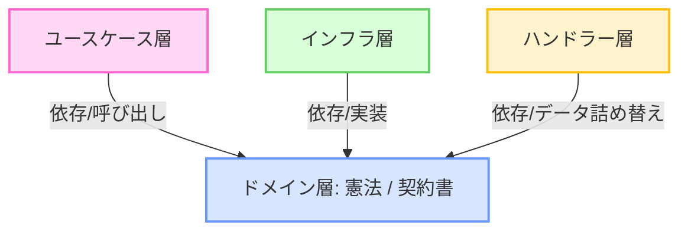

# Uni-Steps ドメイン（ビジネスルール・ドメインモデル層）仕様書

本ドキュメントでは，Uni-Stepsプロジェクトのバックエンドにおいて，最もコアとなるビジネスルールやデータ構造を定義する「ドメイン（ドメイン層）」の各ファイルについて，役割，ドメインモデルとしての意義，および各レイヤー（ユースケース層・インフラ層）との結合関係を，詳細に解説する．

---

## 1. 用語解説

ドメイン層のコードを読む前に，設計上重要となる用語を整理しておく．

| 用語                       | 読み方・別名       | 初学者向けの簡単な意味                                                                                                                                                                                 |
| :------------------------- | :----------------- | :----------------------------------------------------------------------------------------------------------------------------------------------------------------------------------------------------- |
| **ドメイン層**       | Domain Layer       | **「システムの憲法（国の基本ルール）」**．データベースや画面の都合に一切左右されない，このアプリの「本質的なデータ構造」と「不変のビジネスルール」が記述された最重要レイヤーである．             |
| **エンティティ**     | Entity / 実体      | **「IDで区別される重要なデータ」**．例えば `User` や `Task` のように，名前が同じでもIDが違えば別人として扱うような，永続的に管理されるデータオブジェクトを指す．                             |
| **ドメインロジック** | Domain Logic       | **「データそのものに紐づく絶対ルール」**．「タスクのタイトルは空であってはならない」など，データベースの保存方式や通信手段に関わらず，データが満たすべき正しい状態を守るためのプログラムである． |
| **インターフェース** | Interface / 契約書 | **「メソッド（機能）の約束事」**．「このメソッドを呼べばタスクを保存できる」「このメソッドを呼べばAIが文章を作る」という，メソッドの入力と出力の型だけを規定した契約書である．                   |

---

## 2. ドメイン層の役割と「依存の終着点」

ドメイン層（[backend/domain](file:///home/yuma25/github/Uni-Steps/backend/domain) パッケージ）は，クリーンアーキテクチャの同心円の**「一番内側」**に位置する．

### 飲食店での役割例え：

* **ドメイン層（メニュー表と食材の基本規則）**: **本仕様書が担当する部分**．「ステーキ（Task）には必ず肉の部位（Title）と焼き加減（Deadline）がなければならない」という不変のレシピ（ドメインロジック）と，厨房や仕入れ業者が交わす「この形で食材を発注すること」という契約書（インターフェース）を規定する．
* **ユースケース層（料理人）**: レシピ（ドメインロジック）を読みながら，実際に調理手順をコントロールする．
* **インフラ層（調理器具・冷蔵庫）**: 契約書（インターフェース）に沿って，物理的な冷蔵庫（PostgreSQL）からステーキを取り出す実務を担当する．



ドメイン層の最大の特徴は，**「他のどのレイヤーのコードもインポートしてはならない（他のどこにも依存していない）」**という点である．Webフレームワーク（Echo）やORM（GORM）のコードも，本来はここには登場しない（※実利上の妥協として構造体タグのみ記述しているが，ロジックとしての依存はない）．

---

## 3. 各ドメインファイルの詳細解説

### ① [user.go](file:///home/yuma25/github/Uni-Steps/backend/domain/user.go)

* **定義しているもの**: ユーザーの基本情報（[User](file:///home/yuma25/github/Uni-Steps/backend/domain/user.go#L7) 構造体）．
* **なぜドメイン層にあるのか**: アプリの利用者（ID，表示名，メールアドレス，Google API接続用の認証情報など）がシステム内でどう扱われるかを決定する基本設計図だからである．
* **解説**:
  * `ID`：ユーザーを一意に識別するUUID．
  * `Email`：Googleログインで本人確認を行うキーであり，一意でなければならないため `gorm:"unique"` 制約を指定している．
  * `Groups`：多対多アソシエーション（`many2many`）が定義されており，ユーザーが複数の部屋（グループ）に所属可能であることを示す．

---

### ② [group.go](file:///home/yuma25/github/Uni-Steps/backend/domain/group.go)

* **定義しているもの**: グループ（[Group](file:///home/yuma25/github/Uni-Steps/backend/domain/group.go#L12) 構造体）と，AIの性格設定用の定数値．
* **なぜドメイン層にあるのか**: タスク管理や起床見守りを行う「部屋」のルールを記述するためである．
* **解説**:
  * `AICharacterDefault` などの定数を定義し，AIがどのようなキャラクター（指導官，幼馴染，執事など）でメンバーと対話するかを決定する．
  * `RemindIntervals`：期限の何分前に通知するかを表す数値配列（例：`[]int{1440, 60}` ＝ 24時間前と1時間前）．データベース保存時にJSONにシリアライズするため，GORM用のシリアライザー（`gorm:"serializer:json"`）を指定している．

---

### ③ [task.go](file:///home/yuma25/github/Uni-Steps/backend/domain/task.go)

* **定義しているもの**: 課題データ（[Task](file:///home/yuma25/github/Uni-Steps/backend/domain/task.go#L24) 構造体），担当者ごとの完了進捗（[TaskUserProgress](file:///home/yuma25/github/Uni-Steps/backend/domain/task.go#L42) 構造体），および手動登録時の初期化処理や入力バリデーション（ドメインロジック）である．
* **なぜドメイン層にあるのか**: 「タスクにタイトルがない登録はエラーとする」といった，システム全体が絶対に譲れないデータバリデーションルールを定義するためである．
* **解説**:
  * `SetupManualDefaults`（L51）：手動登録時に，IDの自動割り当てや，登録元（`Source`）を `manual` にセットする初期化ロジック．
  * `Validate`（L68）：「タイトルが空の場合はエラーを返す」というビジネスルールを強制するバリデーションロジック．

---

### ④ [wakeup.go](file:///home/yuma25/github/Uni-Steps/backend/domain/wakeup.go)

* **定義しているもの**: 起床見守りデータ（[WakeupCheck](file:///home/yuma25/github/Uni-Steps/backend/domain/wakeup.go#L14) 構造体）と，見守り状態の定数値．
* **なぜドメイン層にあるのか**: 朝起きられたかどうかという，起床見守り機能の状態遷移（確認待ち `pending` ➔ 起床成功 `confirmed` ➔ 寝坊 `alerted`）を定義するためである．
* **解説**:
  * `GraceMinutes`（猶予時間）などのフィールドを含み，予定時刻から何分待ってSOSを送るかを表現する．

---

### ⑤ [notification_log.go](file:///home/yuma25/github/Uni-Steps/backend/domain/notification_log.go)

* **定義しているもの**: 送信された通知の履歴（[NotificationLog](file:///home/yuma25/github/Uni-Steps/backend/domain/notification_log.go#L15) 構造体）と，ログの保存・取得用約束事（[NotificationLogRepository](file:///home/yuma25/github/Uni-Steps/backend/domain/notification_log.go#L25) インターフェース）．
* **なぜドメイン層にあるのか**: 送信履歴という監査データを一意に管理するためである．

---

### ⑥ [repository.go](file:///home/yuma25/github/Uni-Steps/backend/domain/repository.go)

* **定義しているもの**: データベース永続化に関するすべてのインターフェース定義（`TaskRepository`, `UserRepository`, `GroupRepository`, `WakeupRepository`）．
* **なぜドメイン層にあるのか**:
  ビジネスロジック（ユースケース）が，「データの保存・検索として，どのような機能（メソッド）を必要としているか」という仕様を，インフラの実装（SQLやGORM）に依存しない形で規定するためである（依存性逆転の原則の要）．

---

### ⑦ [ai.go](file:///home/yuma25/github/Uni-Steps/backend/domain/ai.go)，[lms.go](file:///home/yuma25/github/Uni-Steps/backend/domain/lms.go)，[notification.go](file:///home/yuma25/github/Uni-Steps/backend/domain/notification.go)

* **定義しているもの**: AI文章生成（`AIService`），外部Classroom同期（`LMSService`），通知送信（`NotificationService`），タイマー予約（`SchedulerService`）の各インターフェース定義．
* **なぜドメイン層にあるのか**:
  「AIでメッセージを作る」「LINEやブラウザプッシュで通知を送る」といった，外部のシステムと通信する複雑な機能を，ドメイン層がコントロールできる安全な形（インターフェースという抽象的な約束事）に変換するためである．

---

## 4. 構造体タグによるマッピングとクリーンアーキテクチャの妥協点

前述の通り，ドメイン構造体の中には，以下のように `json` タグや `gorm` タグが記述されている．

```go
ID string `json:"id" gorm:"primaryKey"`
```

### なぜ純粋なはずのドメイン層にタグが存在するのか？

これは**「実利的なクリーンアーキテクチャ」**の設計方針によるトレードオフである．

1. **本来（厳密なクリーンアーキテクチャ）**:
   ドメインモデルにはタグを一切記述せず，インフラ層に `gorm` タグ付きの「DB専用構造体」，インターフェース層に `json` タグ付きの「API専用DTO構造体」を個別に作成し，相互にデータをコピー（マッピング）すべきとされる．
2. **本システムの選択**:
   構造体を分けると，モデル変更のたびに3つのファイルを修正してマッパーコードを書く必要があり，ボイラープレート（定型句）が膨大になる．そこで，あえてドメイン構造体の中にアノテーション（タグ）を埋め込むことで，コード量を最小限に抑え，開発速度を最大化するアプローチ（ドメインモデルとデータモデルの同一視）を選択している．
