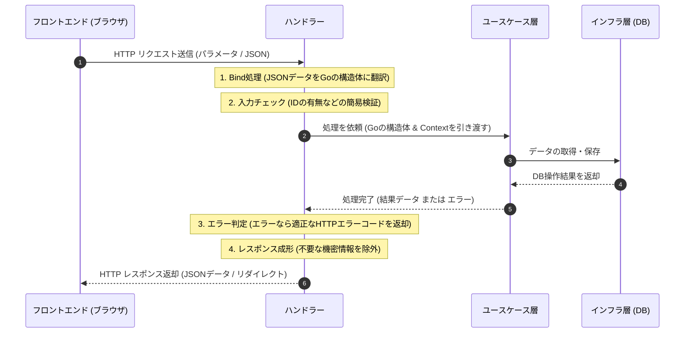

# Uni-Steps ハンドラー（インターフェース層）仕様書

本ドキュメントでは，Uni-Stepsプロジェクトのバックエンドにおいて，Webブラウザ（フロントエンド）や外部サービスからの HTTP リクエストを直接受け付ける「ハンドラー（インターフェース層）」の各ファイルについて，役割，ルーティング，他レイヤー（ユースケース層・インフラ層）との具体的なデータ連携手順を，初学者向けに詳細に解説する．

---

## 1. 初学者向けのWeb用語解説（これだけは知っておこう）

ドキュメントやコードを読む前に，バックエンド開発でよく登場する基本用語を整理しておく．

| 用語 | 読み方・別名 | 初学者向けの簡単な意味 |
| :--- | :--- | :--- |
| **ハンドラー** | Handler / コントローラー | **「リクエストの受付窓口」**．スマホやブラウザからのHTTPリクエスト（注文）を受け取り，適切な処理に振り分ける係である． |
| **エンドポイント** | Endpoint / ルート | **「APIのURL」**．`POST /api/tasks` のように，処理を呼び出すためのURLとHTTPメソッドの組み合わせを指す． |
| **Bind** | バインド | **「データの自動詰め替え」**．画面から送られてきたJSONデータ（文字列）を，Go言語のプログラムが読める構造体（変数）に自動で翻訳して詰め込む作業である． |
| **Context** | コンテキスト / `ctx` | **「リクエスト全体の監視バケツ」**．処理のタイムアウト制限（例：「5秒で応答がなければ打ち切る」）や，リクエストごとの一時情報を持ち運ぶ仕組みである． |
| **OAuth 2.0** | オーオース | **「他社アカウントでのログイン機能」**．今回はGoogleのアカウント情報を使って，安全にUni-Stepsへログインするための業界共通規格である． |
| **CSRF対策 / State** | シーエスアールエフ / 状態 | **「なりすましログイン防止」**．ログインの開始時と終了時で「使い捨ての秘密の合言葉（`state`）」を突合し，第三者が横から割り込んでログインするのを防ぐセキュリティ対策である． |
| **DTO** | Data Transfer Object | **「通信用のデータ包み」**．データベースにある生データから，パスワードなどの「他人に見せてはいけない情報」を除外した，フロントエンド送信用の一時的な構造体である． |
| **DI** | Dependency Injection / 依存性注入 | **「使う道具を外から貰うこと」**．ハンドラーが直接データベース接続を作るのではなく，起動時に「はい，これを使ってデータ保存してね」とリポジトリを渡してもらう設計手法である． |

---

## 2. ハンドラー層の共通役割と基本処理フロー

ハンドラー層（[backend/interfaces/handler](file:///home/yuma25/github/Uni-Steps/backend/interfaces/handler) パッケージ）は，Webフレームワークである **Echo** の機能を使ってWebの窓口になる．

最大の目的は**「Web（HTTP）の知識をここに閉じ込め，コアロジック（ユースケース層）をWebフレームワークから独立させること」**である．これにより，将来的にWebサーバーをEchoから他のものに変えたり，コマンドラインから直接実行するように変更したりしても，コアのロジックは一切変更せずに済む．

### 基本処理フロー（シーケンス図）

どのハンドラーも，以下の5段階のステップを踏んでリクエストを処理する．

---

## 3. 各ハンドラーファイルの詳細解説

### ① [auth_handler.go](file:///home/yuma25/github/Uni-Steps/backend/interfaces/handler/auth_handler.go)
*   **やること**: Googleのアカウント情報を使って，ユーザーが安全にシステムにログイン・新規登録（サインアップ）できるようにする．
*   **なぜ必要か？**: ユーザーにパスワードを入力・管理させることなく，Googleの認証システムにログイン処理を安全に代行してもらうためである．
*   **エンドポイント**:
    *   `GET /api/auth/google/login` : ユーザーをGoogleのログイン画面（認可画面）へ案内（リダイレクト）する．
    *   `GET /api/auth/google/callback` : Googleでのログイン完了後，Googleから返ってきたデータを元にアプリのログイン状態を確立する．
*   **使っている道具（依存関係）**:
    *   `userRepo`: `domain.UserRepository`（ユーザー情報をDBに保存・検索する仕組み）
    *   `oauthCfg`: `*oauth2.Config`（Google APIと通信するための設定情報．クライアントIDなどが含まれる）
*   **具体的な連携手順（処理の流れ）**:
    1.  **ログイン開始 (`GoogleLogin`)**:
        *   セッションハイジャック（なりすまし）を防ぐため，ランダムな文字列 `state` を作り，ブラウザのCookie（秘密のメモ）に「oauth_state」という名前で保存する．
        *   GoogleのログインURLにこの `state` を添えて，ブラウザに対して「Googleのページへ行ってください」と命令（リダイレクト指示）する．
    2.  **Googleから戻ってきたとき (`GoogleCallback`)**:
        *   ブラウザから返ってきた `state` と，先ほどCookieに保存した `state` が一致するか確認する（一致しなければ不正アクセスとして弾く）．
        *   Googleから発行された「認可コード（`code`）」を，`oauthCfg.Exchange` を使ってGoogleサーバーに送り，「アクセストークン（Google Classroom APIを叩くための鍵）」に交換する．
        *   トークンを使って「この人は誰か？」というGoogleユーザープロフィールを取得し，メールアドレスを特定する．
        *   取得したメールアドレスでDBを検索（`FindByEmail`）し，いなければ新規ユーザーとして登録（`Save`）し，すでに登録があればGoogleトークンの情報を更新して保存する．
        *   最後にフロントエンドのグループ選択画面（`/select-group?user_id=xxx`）へリダイレクトする．

---

### ② [group_handler.go](file:///home/yuma25/github/Uni-Steps/backend/interfaces/handler/group_handler.go)
*   **やること**: ユーザーが集まる「部屋（グループ）」の作成，招待コードによる他ユーザーの参加，グループ設定（リマインド通知間隔やAIの性格，サマリの配信時間など）の変更，部屋の削除や退出の処理を行う．
*   **なぜ必要か？**: Uni-Stepsでは，タスク管理や起床見守りはすべて「グループ（部屋）」単位で行われるため，この部屋自体の設定やメンバー構成を管理する必要があるためである．
*   **エンドポイント**:
    *   `POST /api/groups` : 部屋を新規作成する．
    *   `POST /api/groups/join` : 招待コードを入力して部屋に参加する．
    *   `PATCH /api/groups/:groupId/settings` : リマインドの間隔やAIの性格, LINE BotのIDなどを設定変更する．
    *   `DELETE /api/groups/:groupId` : 部屋を削除する（作成したオーナーのみ可能）．
    *   `DELETE /api/groups/:groupId/users/:userId` : 部屋から退出する．
    *   `GET /api/groups/:groupId/notifications` : LINEやプッシュ通知で過去にどんなメッセージが送られたかのログ履歴を取得する．
*   **使っている道具（依存関係）**:
    *   `groupUsecase`: `*usecase.GroupUsecase`（グループ操作に関するすべての業務手順が書かれたロジック層）
*   **具体的な連携手順（処理の流れ）**:
    1.  **リクエストの受付**: フロントエンドから「部屋ID」「設定したいリマインドのリスト」などが送られてくる．
    2.  **Bind（バインド）**: `c.Bind(&req)` で送られてきたJSONデータをGoの構造体に変換する．
    3.  **ユースケースの呼び出し**: `groupUsecase.UpdateSettings(...)` などを呼び出し，コンテキストとともに設定データを渡す．
    4.  **結果の返却**: ユースケース側で「オーナー権限の確認」「LINEトークンの登録」「DBの更新」などが終わったら，ハンドラーは成功メッセージ（`200 OK`）をフロントエンドに返却する．

---

### ③ [notification_handler.go](file:///home/yuma25/github/Uni-Steps/backend/interfaces/handler/notification_handler.go)
*   **やること**: ユーザーのブラウザに通知を送るための「通知用宛先（Web Pushトークン）」の登録と，「正しく通知が届くか」をその場で検証するテスト送信の実行を行う．
*   **なぜ必要か？**: 課題の締め切り前にプッシュ通知を確実に受け取れるようにするため，ブラウザと通知機能を接続する必要があるためである．
*   **エンドポイント**:
    *   `POST /api/notifications/subscribe` : ブラウザから届いたプッシュ通知の宛先データをDBに登録する．
    *   `POST /api/notifications/test` : ユーザーに対して「テスト通知」をその場で即座に送信する．
*   **使っている道具（依存関係）**:
    *   `userRepo`: `domain.UserRepository`（ユーザーの通知用トークンをDBに保存するため）
    *   `aiService`: `domain.AIService`（テスト通知に表示する「AIが作ったリマインド文面」をGemini APIで生成するため）
    *   `notifService`: `domain.NotificationService`（LINEやWeb Push宛に実際に通信を行ってメッセージを送信するため）
*   **具体的な連携手順（処理の流れ）**:
    1.  **通知購読情報の登録**:
        *   ブラウザが発行した通知用の暗号トークン（Subscription情報）を受け取る．
        *   `userRepo.FindByID` で該当ユーザーのデータをDBから引っ張り出し，`WebPushToken` フィールドにそのトークンを上書きして `userRepo.Save` で保存する．
    2.  **テスト通知の送信**:
        *   「誰宛てに」「どのAIのキャラクター性格で」送るかを受信する．
        *   `aiService.GenerateRemindMessage` を呼び出し，Gemini AIにテスト通知用のメッセージを作ってもらう（例：「おい，テスト通知だ．ちゃんと起きているか？」などの性格に応じた文面）．
        *   `notifService.SendDirectMessage` を使い，作成したメッセージと，通知をクリックした際のリンク先URL（ダッシュボード画面など）を引数に渡して送信処理を実行する．

---

### ④ [task_handler.go](file:///home/yuma25/github/Uni-Steps/backend/interfaces/handler/task_handler.go)
*   **やること**: 課題（タスク）の一覧を画面に表示する，手動で新しい課題を登録する，課題の内容を書き換える，削除する，完了ボタンを押して進捗を更新する，およびGoogle Classroomから自動で最新の課題を取得（同期）する．
*   **なぜ必要か？**: このアプリのメイン機能である「課題管理」のあらゆる操作を，フロントエンドからの要求に応じて処理するためである．
*   **エンドポイント**:
    *   `GET /api/groups/:id/tasks` : 部屋に登録されている課題と，メンバー全員の進捗状態を取得する．
    *   `POST /api/tasks/manual` : 手動で課題を新規追加する．
    *   `POST /api/tasks/sync` : Google Classroom（LMS）から最新の課題情報を取得し，アプリ内のタスクと同期させる．
    *   `PATCH /api/tasks/:id/toggle-completion` : ユーザーが「完了」「未完了」を切り替えた際に，進捗状態を反転させる．
    *   `PUT /api/tasks/:id` : 課題のタイトルや提出期限を修正する．
    *   `DELETE /api/tasks/:id` : 課題を削除する．
*   **使っている道具（依存関係）**:
    *   `taskUsecase`: `*usecase.TaskUsecase`（タスクの追加・編集・完了などの基本業務ロジック）
    *   `syncUsecase`: `*usecase.SyncUsecase`（Google Classroom APIと連携してデータを取り込む複雑な同期業務ロジック）
*   **具体的な連携手順（処理の流れ）**:
    1.  **一覧取得**: `taskUsecase.ListGroupTasks` を呼び出し，DBから該当グループのタスク一覧を取得してそのままJSONとして返却する．
    2.  **手動登録・更新**: `c.Bind(task)` を使って，リクエストボディのJSONをドメインモデルである [Task](file:///home/yuma25/github/Uni-Steps/backend/domain/task.go#L11) 構造体に直接マッピングし，`taskUsecase.RegisterManualTask` や `taskUsecase.UpdateTask` へ引き渡す．
    3.  **Classroom同期の例 (`SyncTasks`)**:
        *   フロントエンドから「同期を実行するユーザーID」と「同期先の部屋ID」が送られてくる．
        *   `syncUsecase.SyncTasks` を呼び出す．
        *   `SyncUsecase` の内部では，ユーザーのGoogleアクセストークンを使ってGoogle API（外部サービス）へ問い合わせを行い，取得した課題データを現在のDBデータと比較して，新規保存や更新を行う．
        *   処理が終わると，同期された最新の課題リストが返ってくるため，ハンドラーは `200 OK` とともにそのリストをJSONとして画面に返却する．

---

### ⑤ [user_handler.go](file:///home/yuma25/github/Uni-Steps/backend/interfaces/handler/user_handler.go)
*   **やること**: 指定されたユーザーのプロフィール情報（ID，名前，メールアドレス，プッシュ通知の設定状況）を返却する．
*   **なぜ必要か？**: ログインした本人の情報や，通知の登録が正しく終わっているかを画面に表示するためである．
*   **エンドポイント**:
    *   `GET /api/users/:id` : 特定のユーザー情報を取得する．
*   **使っている道具（依存関係）**:
    *   `userRepo`: `domain.UserRepository`（ユーザーの生データをDBから読み出すため）
*   **具体的な連携手順（処理の流れ）**:
    1.  URLの `:id` 部分からユーザーIDを読み取る（例: `/api/users/usr_123` ➔ `usr_123`）．
    2.  `userRepo.FindByID` を呼んで，DBからユーザーデータを取得する．
    3.  **セキュリティ対策（DTOの簡易適用）**: DBから取得した生の [User](file:///home/yuma25/github/Uni-Steps/backend/domain/user.go#L7) 構造体には，Googleのアクセストークンや通知用の暗号キーなどの「フロントエンドに見せてはならないデータ」が含まれている．そのため，必要な情報（`id`，`name`，`email`，`has_push_token`）だけを取り出した臨時のマップ（JSON）をハンドラー内で作成し，安全にフロントエンドへ返却する．

---

### ⑥ [wakeup_handler.go](file:///home/yuma25/github/Uni-Steps/backend/interfaces/handler/wakeup_handler.go)
*   **やること**: ユーザーの明日の起床予定時刻を登録する，朝起きた時に「起きました！」ボタンを押して見守りを終了させる，見守り予定をキャンセルする，メンバーの起床予定一覧を表示する．
*   **なぜ必要か？**: 朝起きられなかった場合にグループメンバーへSOS通知を送る「起床見守り機能」の管理窓口となるためである．
*   **エンドポイント**:
    *   `POST /api/wakeup/request` : 起床予定時刻（朝7時など）をセットする．
    *   `POST /api/wakeup/checkin` : 「起きました！」と報告する．
    *   `DELETE /api/wakeup/cancel` : セットした起床見守りをやめる．
    *   `GET /api/groups/:groupId/wakeups/active` : グループメンバーの中で，いま現在誰が起床見守り中（寝ている状態）かを一覧取得する．
*   **使っている道具（依存関係）**:
    *   `wakeupUsecase`: `*usecase.WakeupUsecase`（起床見守りのスケジュール予約や，チェックイン時のタイマー解除などを処理する業務ロジック）
*   **具体的な連携手順（処理の流れ）**:
    1.  **見守りの予約 (`RequestWakeupCheck`)**:
        *   JSONから送られてきた「予定時刻（文字列）」を `time.Parse` 関数を使ってGoの正確な日付時間型（`time.Time`）に変換する．
        *   `wakeupUsecase.RequestWakeup` を呼び出して，DBに「見守り中」のデータを追加する．
        *   同時に，ユースケースの内部で「予定時刻から指定分（猶予時間）が経過しても起きましたボタンが押されなければ，自動でグループにSOSを送る」ためのタイマー（スケジューラー）を起動する．
    2.  **CheckIn（起床報告）**:
        *   ユーザーIDを受け取り，`wakeupUsecase.ConfirmWakeup` を呼び出す．
        *   `WakeupUsecase` は，該当ユーザーの進行中の見守りを「起床成功（`confirmed`）」に書き換え，バックグラウンドのアラート送信タイマーを停止する．
        *   ハンドラーは「起床を確認した．おはよう！」のメッセージを返却する．

---

## 4. なぜハンドラーが直接データベース（DB）を触らないのか？

初学者がコードを読んだときに，「なぜハンドラーの中から直接SQLを実行してデータを保存しないのか？（なぜユースケース層をわざわざ挟むのか？）」と疑問に思うかもしれない．

これはクリーンアーキテクチャの**「関心の分離（責任の分担）」**が理由である．

### 飲食店での役割例え：
*   **ハンドラー（受付・ウェイター）**: 
    お客様（フロントエンド）から注文（HTTPリクエスト）を取り，注文内容に間違いがないかチェックし，調理場（ユースケース）にオーダーを伝える．料理ができあがったら，綺麗にお皿（JSON）に盛り付けてお客様に提供する．**直接料理（DBの保存・計算処理）はしない．**
*   **ユースケース（料理人）**: 
    オーダーを受け，レシピ（ビジネスロジック）に沿って調理を行う．材料が足りなければ倉庫（リポジトリ）にデータを取りに行く．**直接お客様の接客（HTTPヘッダーの解析やJSONエラー文の作成）はしない．**

このように役割を完全に分けることで，ハンドラー（受付）は「Webリクエストをどう受け取り，どう返すか」だけに集中でき，コードがシンプルに保たれる．また，自動テストを書く際も「Web接続なしで料理人だけのテスト（ユースケースの単体テスト）」を簡単に行うことができるようになる．
