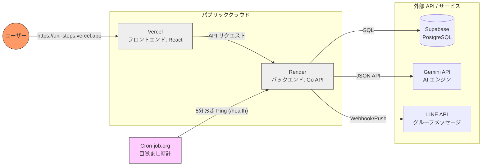

# インフラ・ネットワーク構成 (Zero-Cost Infrastructure)

## 1. サービス全体図
無料枠を最大活用し，かつ独自ドメイン風の運用を可能にする構成である．

## 2. インフラ選定詳細

| コンポーネント | サービス名 | 無料枠の活用 | 独自ドメイン/URL |
| :--- | :--- | :--- | :--- |
| **Hosting (Static)** | Vercel | 帯域・ビルド無制限 | `*.vercel.app` (独自ドメイン可) |
| **Hosting (Compute)** | Render | 512MB RAM，CPU共有 | `*.onrender.com` (独自ドメイン可) |
| **Database** | Supabase | 500MB DB，5GB Storage | 内部APIキー接続 |
| **External API** | Gemini AI | 15 RPM (Flashモデル) | APIキー接続 |
| **Keeping Alive** | Cron-job.org | 無制限 | RenderのURLを定期実行 |
