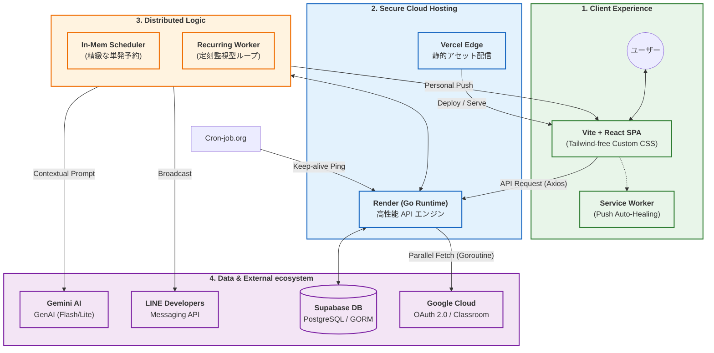

# Uni-Steps ｜ 技術アーキテクチャ & インフラ構成

本ドキュメントは，ハッカソンや技術プレゼンテーション向けの，Uni-Steps のシステム全容を俯瞰するリファレンスである．「コストゼロ」で「プロフェッショナル品質」のサービスを実現するための，緻密な技術選定とデータフローを記述している．

---

## 1. テックスタック・マトリクス (The Tech Stack)

Uni-Steps は，最新のモダン技術を適材適所で組み合わせた，フルスタック・アーキテクチャを採用している．

| カテゴリ | 採用技術 | 選定の決め手 |
| :--- | :--- | :--- |
| **Frontend** | **React 19 + TypeScript** | 高速な SPA 開発，型安全なコンポーネント設計，モダンな Hooks 活用． |
| **Backend** | **Go 1.22 + Echo v4** | 超軽量・高速な API サーバー，並列処理（Goroutine）による高いスループット． |
| **Database** | **Supabase (PostgreSQL)** | GORM との親和性，JSONB サポート，Supabase Auth 連携の将来性． |
| **AI Intelligence**| **Google Gemini API** | Flash モデルによる爆速推論，無料枠での高いレート制限（15 RPM）． |
| **Infrastructure** | **Vercel & Render** | デプロイの自動化，エッジ配信，無料枠での Docker 運用． |
| **Messaging** | **LINE + Web Push** | 日本国内のリーチ力と，ブラウザネイティブの即時性のハイブリッド． |

---

## 2. システム構成図 (Visual Architecture)



---

## 3. 処理のライフサイクル (Critical Pipelines)

### 🚀 01. パフォーマンス特化の同期処理 (Parallel Sync)
Google Classroom からの課題取得は，Go の **Goroutine** を用いて全コースを**完全並列**でスキャンする．さらに，DB 書き込み前にメモリ上で全件照合を行うことで **N+1 問題を解消**．数秒で全課題の同期が完了する．

### ⏰ 02. 二段構えのスケジュール管理 (Dual Timing)
*   **単発予約 (Scheduler)**: 起床 SOS やリマインドなど，ミリ秒単位の精度が求められるイベントは，Go の `time.AfterFunc` による精密タイマーで制御．
*   **定刻監視 (Worker)**: 朝夕のサマリー配信は，設定変更に強い 1分間隔の常駐監視ワーカーが担当．負荷を最小限に抑えつつ，柔軟な運用を可能にしている．

### 🛡️ 03. 自律的な自己修復通知 (Self-healing Notification)
Web Push トークンが失効（410 Gone）した場合，サーバー側で即座に無効化．次にユーザーがアプリを開いた際，フロントエンドが権限を確認して**サイレントに再登録**を実行．ユーザーに意識させない「切れない通知」を実現．

---

## 4. プロフェッショナル・エラーハンドリング

フロントエンド（TypeScript）において，バックエンド（Go）の哲学を継承した **[結果, エラー] タプル形式** を全面的に採用．
```ts
// Go言語の if err != nil { ... } と同じ直感的なコーディング
const [data, err] = await handle(apiCall());
if (err) {
  // 型安全なエラー処理
  return handleError(err);
}
```
これにより，ネストの浅い，保守性に極めて優れたコードベースを維持している．

---
*最終更新日: 2026年6月14日*
*Uni-Steps: Your life rhythm partner.*
