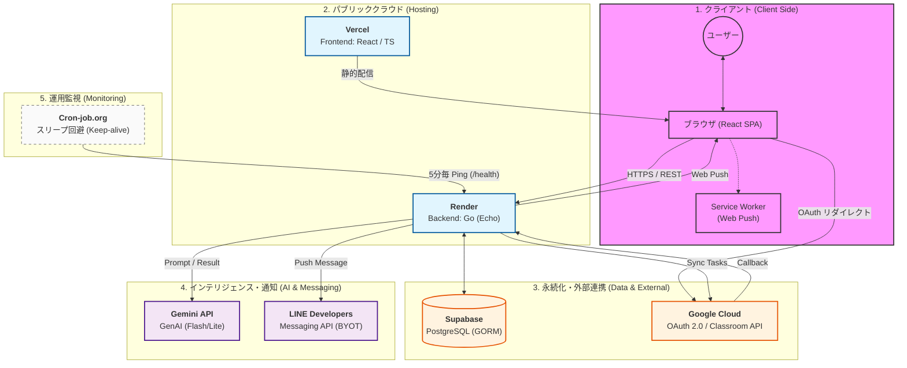

# インフラ・システム構成図 (Cloud Architecture)

本ドキュメントは，Uni-Steps の全体的なインフラ構成，ネットワーク経路，および主要なデータフローを定義したものである．無料枠を最大限に活用しつつ，堅牢なセキュリティとスケーラビリティを両立した設計を採用している．

---

## 1. システム全体俯瞰図 (Architecture Overview)

Uni-Steps は，フロントエンド（Vercel）とバックエンド（Render）を分離したモダンなデカップルド・アーキテクチャを採用している．

---

## 2. 主要なデータフロー (Critical Sequences)

### 2.1 認証と同期の連鎖 (Auth & Sync Flow)
1.  **ユーザー**がブラウザから「Google ログイン」を実行．
2.  **Google Cloud** で承認後，**Render** へ認可コードが返る．
3.  **Render** がアクセストークンを取得し，**Supabase** へユーザー情報を保存．
4.  初回ログイン時，**Render** が **Google Classroom** から課題を並列取得（Goroutine）．
5.  取得した課題を **Gemini** で解析（必要時）し，**Supabase** へ永続化．

### 2.2 起床見守りと SOS 発信 (Wakeup & SOS Flow)
1.  **ユーザー**が起床時間を予約．
2.  **Render (Scheduler)** がメモリ上にタイマーをセット．
3.  予定時刻 ＋ 猶予時間を過ぎてもチェックインがない場合，タイマーが発火．
4.  **Render** が **Gemini** に「寝坊した仲間を呼ぶ緊急メッセージ」の生成を依頼．
5.  生成された文章を **LINE (グループ)** と **Web Push (個人)** へ同時多発的に配信．

### 2.3 定期サマリーの自動配信 (Automatic Summary)
1.  **Cron-job.org** が 5分おきに **Render** を叩き，冬眠を防止．
2.  **Render** 内のバックグラウンドワーカーが 1分おきに全グループの配信設定を確認．
3.  設定時刻に達したグループの課題状況を **Supabase** から集計．
4.  **Gemini** が状況を要約し，チーム全体へ「朝刊/夕刊」として報告．

---

## 3. インフラ採用技術と選定理由

| レイヤー | サービス名 | 選定理由 |
| :--- | :--- | :--- |
| **Frontend** | Vercel | 高速な CDN 配信，GitHub 連携による自動ビルド，および SPA との親和性． |
| **Backend** | Render | Go 言語のネイティブサポート，無料枠での Docker / Web Service 運用が可能． |
| **Database** | Supabase | PostgreSQL をマネージドで提供．JSONB 検索や外部連携に強い． |
| **AI Engine** | Gemini API | 無料枠での高いレート制限（15 RPM）と，Flash モデルによる超高速推論． |
| **Messaging** | LINE API | 日本国内で最もリーチ力の高いインフラを活用し，緊急時の気付きを最大化． |
| **Reliability** | Cron-job.org | Render のスリープ特性を補完し，24時間稼働の「見守り」を低コストで実現． |

---
*最終更新日: 2026年6月14日*
