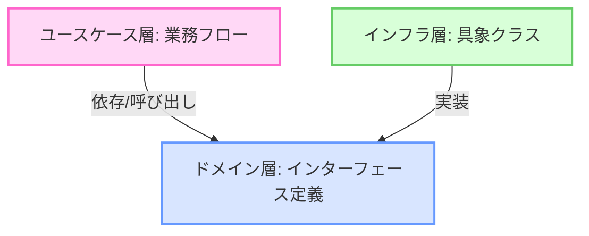

# Uni-Steps インフラストラクチャ（インフラ層）仕様書

本ドキュメントでは，Uni-Stepsプロジェクトのバックエンドにおいて，データベース（PostgreSQL）や外部API（Google Classroom，Gemini AI，LINE，Web Push）などの具体的な技術要素と直接通信する「インフラストラクチャ（インフラ層）」の各パッケージについて，役割，ドメイン層（インターフェース）との結合関係，具体的な処理の流れを詳細に解説する．

---

## 1. 初学者向けの用語解説（これだけは知っておこう）

インフラ層のコードを読む前に，登場する技術用語を整理しておく．

| 用語                       | 読み方・別名            | 初学者向けの簡単な意味                                                                                                                                                                                           |
| :------------------------- | :---------------------- | :--------------------------------------------------------------------------------------------------------------------------------------------------------------------------------------------------------------- |
| **インフラ層**       | Infrastructure Layer    | **「社会のインフラ（水道・ガス・電気）」**に相当する，データベースや外部のクラウドサービス，通知用APIなどを具体的に動かすためのプログラムが属するレイヤーである．                                                |
| **依存性逆転の原則** | DIP                     | **「インターフェースを挟んで結合すること」**．ユースケース層はインフラ層を直接知らず，ドメイン層のインターフェースだけを知る．インフラ層がそれを「実装」することで，依存の向きを逆転させる設計手法である． |
| **GORM**             | ORM（ジーオーム）       | **「データベース操作の翻訳ツール」**．Go言語の構造体とデータベースのテーブルを自動でマッピングし，SQL文を直接書かなくてもデータのCRUD操作ができるようにするライブラリである．                              |
| **Gemini SDK**       | ジェミニ エスディーケー | **「Gemini AIと会話するための道具箱」**．Googleが提供する公式ライブラリであり，APIキーをセットしてメッセージを送るだけで，高度なAIテキストを生成できる．                                                   |
| **VAPID**            | ヴァピッド              | **「Webプッシュ通知用の電子証明書」**．ブラウザの通知サーバーに対し，「これは悪意ある第三者ではなく，信頼できるUni-Stepsサーバーから送られた通知である」と証明するためのデジタル署名技術である．           |
| **time.AfterFunc**   | アフターファンク        | **「Go言語のキッチンタイマー機能」**．「指定時間後に，あらかじめ登録しておいた処理（関数）をバックグラウンドで実行する」ためのGo標準の標準タイマー機能である．                                             |

---

## 2. インフラ層の役割と「依存性逆転（DIP）」のメリット

インフラ層（[backend/infrastructure](file:///home/yuma25/github/Uni-Steps/backend/infrastructure) パッケージ）は，プログラムの一番外側に位置し，特定の技術（GORM，PostgreSQL，HTTP通信，LINE API，Google API，Gemini API）に直接依存している．

### 飲食店での役割例え：

* **ドメイン層（メニュー表の規格）**: 「ステーキを焼くときは，焼き加減を指定できなければならない」というルール（インターフェース）を規定する．
* **インフラ層（具体的な調理器具）**: **本仕様書が担当する部分**．「ガスコンロ（GORM）」「超高性能AIオーブン（Gemini）」「配送バイク（LINE API）」など，調理や配送を実際に実行する物理的な道具や外部サービスである．

ユースケースはドメイン層の抽象的なインターフェース（例：`TaskRepository`）だけを呼び出し，インフラ層はそれを実装する（例：`db.NewTaskRepository`）．これによって，データベースをPostgreSQLから別のものに変更したくなっても，ユースケース層のプログラム（料理人）は1行も書き換える必要がないというメリットがある．

---

## 3. 各サブパッケージ（インフラ部品）の詳細解説

### ① [db（データベース永続化）](file:///home/yuma25/github/Uni-Steps/backend/infrastructure/db)

* **やること**: GORMライブラリを使用して，PostgreSQLデータベースに対するデータの保存，検索，更新，削除を実行する．
* **なぜGORMを使うのか**:
  生のSQL（`INSERT INTO...`）を書く場合，カラム追加のたびにSQL文の書き換えが必要になりバグが起きやすいが，GORMを使うことでGoの構造体を渡すだけで安全かつシンプルにデータベース操作ができるためである．
* **実装しているインターフェース**:
  * `group_repository.go` ➔ `domain.GroupRepository`
  * `task_repository.go` ➔ `domain.TaskRepository`
  * `user_repository.go` ➔ `domain.UserRepository`
  * `wakeup_repository.go` ➔ `domain.WakeupRepository`
  * `notification_log_repository.go` ➔ `domain.NotificationLogRepository`
* **具体的なデータ連携手順（GORMによる保存の例）**:
  1. ユースケースが `taskRepo.Save(ctx, task)` を呼び出す．
  2. `infrastructure/db/task_repository.go` 内の実装が呼び出され，内部で `r.db.WithContext(ctx).Save(task)` を実行する．
  3. GORMが `task` 構造体を解析し，裏側で適切なSQL文（`INSERT` または `UPDATE`）を組み立て，PostgreSQLに送信してデータを永続化する．

---

### ② [ai（Gemini AI 連携）](file:///home/yuma25/github/Uni-Steps/backend/infrastructure/ai/gemini_service.go)

* **やること**: Google Generative AI（Gemini API）にプロンプトを送信し，課題の締め切りリマインド通知や，朝・夕刊のサマリ配信用のAI要約メッセージを，指定された「AIの性格」に合わせて生成する．
* **なぜGemini APIを使うのか**:
  決まりきったシステム定型文ではなく，「軍隊の厳しい教官風」や「心配性な幼馴染風」といった，人間の行動変容を促すユーモラスで多様な文章を動的に生成するためである．
* **実装しているインターフェース**:
  * `gemini_service.go` ➔ `domain.AIService`
* **具体的なデータ連携手順**:
  1. ユースケースが，タスク情報と性格設定（例: `"strict"`）を引数にして `aiService.GenerateRemindMessage` を呼び出す．
  2. [gemini_service.go](file:///home/yuma25/github/Uni-Steps/backend/infrastructure/ai/gemini_service.go) は，Geminiに投げるための指示書（システムプロンプト：キャラクターの性格，文字数の制約，絵文字の使用ルールなど）を組み立てる．
  3. Gemini公式SDKクライアント（`genaiClient.GenerativeModel`）にプロンプトを送信し，AIからの回答テキスト（`Content`）を待機する．
  4. 生成された文章を文字列としてユースケース層に返却する（API接続不良などのエラー時には，フェイルセーフとして用意した日本語の定型文を返す設計が施されている）．

---

### ③ [line（LINE Messaging API 連携）](file:///home/yuma25/github/Uni-Steps/backend/infrastructure/line/line_service.go)

* **やること**: 部屋オーナーが設定したLINE BotのアクセストークンとグループIDを用いて，LINEのプッシュ通知用Web APIを叩き，LINEグループに直接メッセージを送信する．
* **なぜLINEを使うのか**:
  大学生や社会人が最も日常的に利用しているLINEのトークルームにリマインドやSOSを届けることで，通知の未読スルーを最小限にするためである．
* **実装しているインターフェース**:
  * `line_service.go` ➔ `domain.NotificationService`（通知処理のLINE担当）
* **具体的なデータ連携手順**:
  1. ユースケースが `notifService.SendGroupMessage` を呼び出す．
  2. `line_service.go` は `groupRepo.FindByID` を呼び出し，その部屋に登録されている `LineChannelToken`（Botのアクセストークン）と `LineGroupID` を取得する．
  3. LINEのMessaging API仕様（`https://api.line.me/v2/bot/message/push`）に適合するJSONリクエスト（宛先IDとテキストメッセージ）を組み立てる．
  4. Go言語の `net/http` クライアントを使用して，AuthorizationヘッダーにBotのトークンを乗せ，LINEのサーバーに対してHTTP POSTリクエストを直接送信する．

---

### ④ [lms（Google Classroom 連携）](file:///home/yuma25/github/Uni-Steps/backend/infrastructure/lms/google_classroom.go)

* **やること**: Google OAuthのトークンを利用してGoogle Classroom APIに接続し，ユーザーが所属するコース一覧の取得，およびコースに登録されている「課題（CourseWork）」の情報をフェッチする．
* **なぜGoogle Classroomを使うのか**:
  大学などの授業で実際に配布される課題の「タイトル」「期限」「更新時刻」をプログラム的に自動収集し，手動での課題登録の手間をゼロにするためである．
* **実装しているインターフェース**:
  * `google_classroom.go` ➔ `domain.LMSService`
* **具体的なデータ連携手順**:
  1. ユースケースが `lmsService.FetchTasks(ctx, userID)` を呼び出す．
  2. [google_classroom.go](file:///home/yuma25/github/Uni-Steps/backend/infrastructure/lms/google_classroom.go) は `userRepo.FindByID` でユーザー情報を読み出し，Google OAuth2用のアクセストークンを復元する（期限切れなら自動的にリフレッシュトークンを使用して再生成する）．
  3. Google API公式クライアント（`google.golang.org/api/classroom/v1`）を初期化する．
  4. ユーザーに関連するコースの一覧をAPIで取得し，それぞれのコースの中にある課題（CourseWork）の一覧を取得する．
  5. Googleのデータ形式から，Uni-Stepsのドメインモデルである [Task](file:///home/yuma25/github/Uni-Steps/backend/domain/task.go#L11) 構造体の配列へデータを詰め替えて返却する．

---

### ⑤ [notification（通知の複合・振り分け）](file:///home/yuma25/github/Uni-Steps/backend/infrastructure/notification/composite_service.go)

* **やること**: `LINE` 用の通知サービスと，`WebPush` 用の通知サービスの両方を内部に持ち，単一のメソッド呼び出しで「LINEとスマホプッシュの両方」に対して同時にメッセージを送信するデザインパターン（Compositeパターン）を提供する．
* **なぜこれが必要か**:
  ユースケース側で「LINEへの送信処理」と「Webプッシュへの送信処理」を個別に何回も呼ぶとコードが雑然とするため，これらを1つの窓口にまとめることで，ユースケース側のコードをシンプルにするためである．
* **実装しているインターフェース**:
  * `composite_service.go` ➔ `domain.NotificationService`（全体の統括窓口）
* **具体的なデータ連携手順**:
  1. ユースケースが `notifService.SendDirectMessage` を呼び出す．
  2. [composite_service.go](file:///home/yuma25/github/Uni-Steps/backend/infrastructure/notification/composite_service.go) は，保持している `webPushService` を呼び出して対象ユーザーのブラウザ宛てに通知を送信する．
  3. 同時に，もし部屋の設定でLINEグループが紐づけられているメッセージであれば，内部の `lineService` も呼び出してLINEへの送信も行う．

---

### ⑥ [scheduler（メモリ内タイマー予約）](file:///home/yuma25/github/Uni-Steps/backend/infrastructure/scheduler/in_mem_scheduler.go)

* **やること**: Go言語のバックグラウンドスレッド（ゴルーチン）と標準タイマー機能（`time.AfterFunc`）を使用し，メモリ内で「指定時刻になったらリマインドを送信する」「指定時刻までに起きなければSOSを出す」といった非同期のタイマー予約を管理する．
* **なぜこれを使うのか**:
  外部の複雑な cron サーバーやキューシステムを導入することなく，Go言語が持つ高速な並行処理能力を活かして，サーバー単体で手軽かつリアルタイムなスケジュール管理を行うためである．
* **実装しているインターフェース**:
  * `in_mem_scheduler.go` ➔ `domain.SchedulerService`
* **具体的なデータ連携手順（SOS予約の例）**:
  1. 起床見守りユースケースから「起床予定時刻 ＋ 猶予時間（例：朝7時30分）」にSOSを実行するように指示を受け，`ScheduleWakeupSOS` が呼ばれる．
  2. `time.AfterFunc` を使って，現在から7時30分までの時間差を計測し，その時間が経過した時点で自動起動する関数（ゴルーチン）を予約する．
  3. 予約されたタイマーオブジェクト（`*time.Timer`）は，キャンセルできるようにメモリ内のマップ（`sosTimers`）に「見守りID」をキーにして保存される．
  4. **もし本人が7時15分に起きた場合**: ユースケースから `CancelWakeupSOS` が呼ばれ，マップからタイマーを取り出して `timer.Stop()` を実行する．これにより，7時30分のSOSタイマーが安全に解除される．
  5. **もし本人が起きずに7時30分になった場合**: 予約された関数が自動で走り，AIによるSOS文面の生成とLINE/WebPushへの送信処理を非同期で実行する．

---

### ⑦ [webpush（ブラウザプッシュ通知）](file:///home/yuma25/github/Uni-Steps/backend/infrastructure/webpush/webpush_service.go)

* **やること**: ユーザーのブラウザ（Chrome，Safari，Firefoxなど）が登録したプッシュ通知トークン宛に，暗号化されたWeb Pushプロトコルに適合する形式で，直接サーバーから通知を送信する．
* **なぜこれを使うのか**:
  スマートフォンでアプリを開いていない状態（スリープ画面など）でも，ブラウザのシステムを通じてOSネイティブなプッシュ通知を瞬時に届け，リマインドやSOSの認知率を極限まで高めるためである．
* **実装しているインターフェース**:
  * `webpush_service.go` ➔ `domain.NotificationService`（通知処理のWebPush担当）
* **具体的なデータ連携手順**:
  1. ユースケースから `SendDirectMessage(ctx, userID, message, targetURL)` が呼ばれる．
  2. `webpush_service.go` は `userRepo.FindByID` で送信先ユーザーの `WebPushToken` をDBから読み出す．
  3. トークンが登録されている場合，ブラウザごとの通知エンドポイント（GoogleのFCMサーバーやAppleのAPNsサーバーなど）に対し，送信メッセージと遷移先URLを含めたペイロード（データ）を構築する．
  4. サーバーが持つ秘密鍵（`VAPID_PRIVATE_KEY`）を使ってリクエストデータをデジタル暗号署名し，ブラウザの通知ゲートウェイサーバー宛てにセキュアなHTTPリクエストを送信する．
