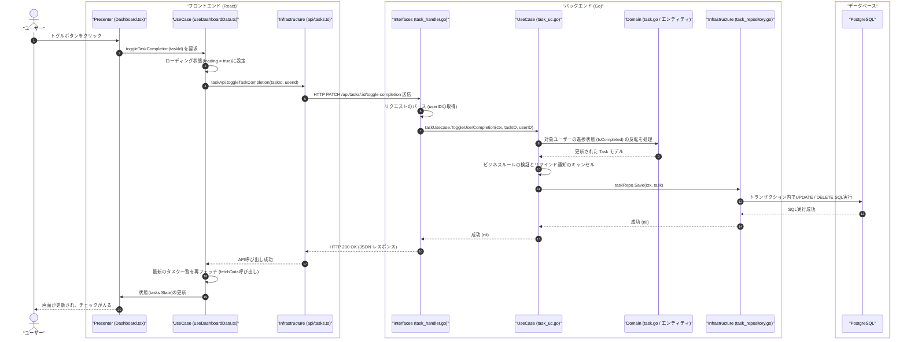

# 【第5回】Uni-Stepsで学ぶクリーンアーキテクチャ：連動編（データの一生）

Uni-Stepsを題材にしたクリーンアーキテクチャ解説連載の最終回（第5回）である．

これまで，バックエンド（Go）とフロントエンド（TypeScript/React）のそれぞれにおいて，どのようにコードを役割ごとに切り離し，依存関係を整理するかを見てきた．
最終回となる今回は，「ユーザーが画面のタスクの完了トグルをクリックしたとき」という1つのシナリオをベースに，リクエストデータがフロントエンドとバックエンドの全レイヤーをどのように駆け巡り，データベースを更新し，最終的に画面に反映されるのか，その **「データの一生（ライフサイクル）」** を追跡する．

---

## 1. エンドツーエンドの全体シーケンス

以下のシーケンス図は，今回のリクエスト処理に関わるすべての登場人物（レイヤー）が，どのように協調しているかを表している．

---

## 2. 各ステップにおける処理と役割の解説

### STEP 1〜3：フロントエンド側の起点
*   **STEP 1 (Presenter/UI)**:
    ユーザーが画面上でチェックボックス（トグル）をクリックする．UIコンポーネント `Dashboard.tsx` は，このクリックイベントを受け取るが，自分自身ではAPIを叩くコードも状態を書き換えるコードも持たない．ただ，渡されている関数 `handleToggle` を呼び出すだけである．
*   **STEP 2 (FE: UseCase/Hook)**:
    カスタムフック `useDashboardData.ts` 内の関数が動き出す．ローディングフラグを `true` にし，画面上に「処理中...」といったフィードバックを出す準備をする．
*   **STEP 3 (FE: Infrastructure/API)**:
    カスタムフックは，通信を担当する `taskApi.toggleTaskCompletion` を呼び出す．

### STEP 4〜5：ネットワークの横断と受付
*   **STEP 4 (通信実行)**:
    APIクライアントは，`Axios` を使ってバックエンドサーバーに対し，`PATCH` メソッドでHTTPリクエストを送信する．
*   **STEP 5 (BE: Interfaces/Handler)**:
    Goで動作しているサーバーの `task_handler.go` の `ToggleTaskCompletion` 関数がリクエストをキャッチする．リクエストパラメータ（どのタスクの，どのユーザーが完了したか）をパース・検証し，ビジネスロジックの実行のために `taskUsecase.ToggleUserCompletion` を呼び出す．

### STEP 6〜8：ビジネスロジックの適用と永続化
*   **STEP 6 (BE: UseCase)**:
    `task_uc.go` 内で，ビジネス上のルールが適用される．
    1.  指定されたタスク情報をリポジトリから取得する．
    2.  対象ユーザーの進捗状態（`IsCompleted`）を反転（完了なら未完了へ，未完了なら完了へ）する．
    3.  もし完了したなら，今後予定されていた「AIによる自動リマインド通知」の予約をすべてキャンセル（スケジューラサービスとの連携）する．
    4.  すべてが整ったら，`taskRepo.Save` を呼び出す．
*   **STEP 7 (BE: Infrastructure/Repository)**:
    `task_repository.go` は，Domainレイヤーの `Task` オブジェクトを受け取り，これをデータベースに永続化する具体的なSQL（またはGORMのコマンド）を発行する．今回はタスクと進捗状況を正しく保存するため，DBトランザクションを使用して保存処理を実行する．
*   **STEP 8 (PostgreSQL)**:
    データベースが値を書き換え，コミット（確定）する．

### STEP 9〜15：結果の返却と画面への反映
*   **STEP 9〜11 (レスポンスの逆流)**:
    データベースの更新成功が，リポジトリ ➔ ユースケース ➔ ハンドラーへとバケツリレー式に返却される．ハンドラーは，最終的に `HTTP 200 OK` というステータスコードを添えて，成功メッセージをフロントエンドへ返信する．
*   **STEP 12〜15 (画面の再描画)**:
    フロントエンドのAPIクライアント（通信レイヤー）が成功を検知し，カスタムフック（UseCaseレイヤー）に処理が戻る．フックは再び最新のタスク一覧をサーバーから取得（`fetchData`）し，Reactの状態（`tasks` state）を更新する．
    Reactのリアクティブな仕組みにより，状態の変更を検知したUIコンポーネントが自動的に再描画され，ユーザーの画面に「チェックが入った状態」が反映される．

---

## 3. 総括：なぜこの面倒な「バケツリレー」をするのか？

一見すると，画面のクリックからデータベースの更新までに非常に多くのクラスや関数を中継しており，「まどろっこしい」「コード量が増えるだけではないか」と感じるかもしれない．

また，クリーンアーキテクチャの同心円モデルにおいて，`Infrastructure`（データベースやGORM等）は最も外側に位置するレイヤーであるにもかかわらず，シーケンス図では右端（Domain の内側）に配置されている点に疑問を持ったかもしれない．

これは，リクエストが「外から入り（Interfaces/Handler） ➔ 内側（UseCase/Domain）を通り ➔ 再び外側（Infrastructure/DB）へと抜けていく」という**時系列のコントロールフロー（データの貫通）**を描いているためである．

ここで最も重要なのが，**「実行時のデータの流れ（左から右）」と「コード上の依存関係（右から左）」が真逆（逆転）している**という点である．
UseCase は最外周の Infrastructure に依存せず，Domain層で定義された抽象（リポジトリのインターフェース）に依存し，Infrastructureがその抽象を実装する．この「**依存性逆転の原則（DIP）**」こそが，最外周である Infrastructure の変更（例：DBの差し替え）が内側のビジネスロジックを破壊しないことを保証するクリーンアーキテクチャの核心である．

この構造を採用することで，アプリケーションは以下のような強力な特性を得ることができる．

1.  **影響範囲が狭くなる**:
    *   DBのテーブル構造を変更しても，影響を受けるのは `infrastructure/db/` と `domain/` だけである．フロントエンドのコードや，バックエンドのハンドラーは一切修正する必要がない．
    *   画面のデザイン（CSSやコンポーネント）をいくら変更しても，バックエンドやフロントの通信処理は無傷である．
2.  **チーム開発が並行して進められる**:
    *   最初に `domain/`（バックエンド）と `types/`（フロントエンド）でデータ構造だけ合意してしまえば，バックエンド担当がDBのSQLを書いている間に，フロントエンド担当はモックAPIを使って画面と画面ロジックを完成させることができる．
3.  **自動テストによる高い品質保証**:
    *   各レイヤーの結合部分（インターフェース）が明確であるため，モックライブラリを用いて「もしAPI通信が失敗したら，画面にエラーメッセージが出るか」といったテストや，「DB保存が失敗したときに，リマインド通知予約が正しくキャンセルされないこと（ロールバックされること）」といったテストが簡単かつ確実に記述できる．

---

## 4. 最後に

全5回にわたり，Uni-Stepsのアーキテクチャを題材にして，クリーンアーキテクチャの理論と実践を見てきた．

クリーンアーキテクチャは決して「バックエンドの複雑なシステムのためだけのもの」でも，「コード量を増やすための堅苦しいルール」でもない．
それは，**「将来の変更コストを下げ，開発者が安心してコードを修正し続けられるようにするための知恵」**である．

ぜひ，開発するアプリでも，この「関心の分離」と「依存方向のコントロール」を取り入れ，クリーンで快適な開発体験を味わってみてほしい．
